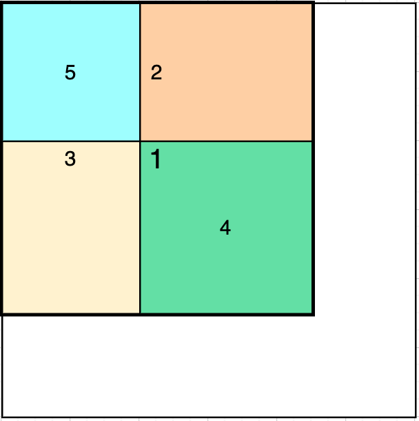

# 304. Range Sum Query 2D - Immutable

## Description
- [Link](https://leetcode.com/problems/range-sum-query-2d-immutable)
- Given a 2D matrix `matrix`, handle multiple queries of the following type:
  - Calculate the sum of the elements of `matrix` inside the rectangle defined by its upper left corner `(row1, col1)` and lower right corner `(row2, col2)`.
- You must design an algorithm where `sumRegion` works on `O(1)` time complexity.

## Solution
### Key Idea
- O(1) time complexity implies that we need to pre-calculate and store range sums for`sumRegion` to run in O(1) time.
- 
  - `4 = 1 - 3 - 2 + 5`
    - `1` contains all
    - `3` contains `5`
    - `2` contains `5`
- `regionSum[i][j] = matrix[i][j] + regionSum[i][j-1] + regionSum[i-1][j] - regionSum[i-1][j-1]`

### Pseudo Code
```
class NumMatrix:
    int[][] regionSum
    NumMatrix(matrix):
        regionSum = new int[matrix.length][matrix[0].length]
        for i in 0 until rows:
            for j in 0 until cols:
                ret = matrix[i][j]
                if j >= 1:
                    ret += regionSum[i][j-1]
                if i >= 1:
                    ret += regionSum[i-1][j]
                if i >= 1 && j >= 1:
                    ret -= regionSum[i-1][j-1]
                regionSum[i][j] = ret
    
    sumRegion(row1, col1, row2, col2):
        ret = regionSum[row2][col2]
        if col1 >= 1:
            ret -= regionSum[row2][col1-1]
        if row1 >= 1:
            ret -= regionSum[row1-1][col2]
        if row1 >= 1 && col1 >= 1:
            ret += regionSum[row1-1][col1-1]
        return ret
    }
}
```

### Time Complexity
- `sumRegion` O(1)